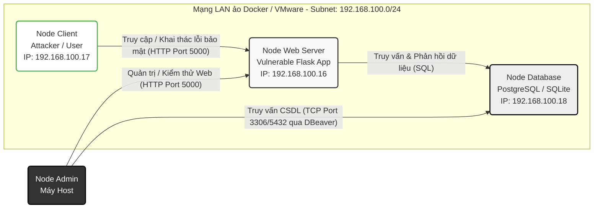

```mermaid
flowchart LR
    %% Định nghĩa các Style 
    classDef admin fill:#333,color:#fff,stroke:#000,stroke-width:2px;
    classDef node fill:#fff,stroke:#4CAF50,stroke-width:2px;
    classDef server fill:#f9f9f9,stroke:#333,stroke-width:2px;
    classDef db fill:#eee,stroke:#000,stroke-width:2px;

    %% Node Admin nằm ngoài subnet ảo (thường là máy Host)
    Admin(Node Admin<br/>Máy Host) 

    subgraph LAN [Mạng LAN ảo Docker / VMware - Subnet: 192.168.100.0/24]
        direction TB
        
        Client(Node Client<br/>Attacker / User<br/>IP: 192.168.100.17):::node
        
        WebServer(Node Web Server<br/>Vulnerable Flask App<br/>IP: 192.168.100.16):::server
        
        Database(Node Database<br/>PostgreSQL / SQLite<br/>IP: 192.168.100.18):::db
    end

    %% Các luồng dữ liệu 
    Client -- "Truy cập / Khai thác lỗi bảo mật (HTTP Port 5000)" ---> WebServer
    Admin -- "Quản trị / Kiểm thử Web (HTTP Port 5000)" ---> WebServer
    Admin -- "Truy vấn CSDL (TCP Port 3306/5432 qua DBeaver)" ---> Database
    WebServer -- "Truy vấn & Phản hồi dữ liệu (SQL)" ---> Database

    %% Gán class cho Admin
    class Admin admin
```
