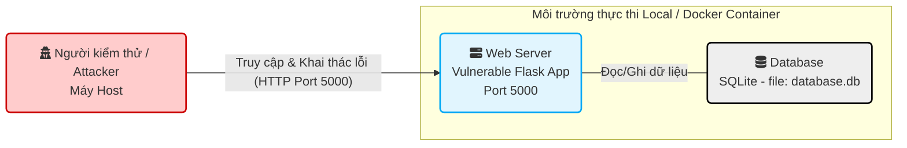

```mermaid
flowchart LR
    %% Định nghĩa các Style
    classDef tester fill:#ffcccc,stroke:#cc0000,stroke-width:2px,border-radius:5px;
    classDef environment fill:#f9f9f9,stroke:#333,stroke-width:2px,border-radius:10px,stroke-dasharray: 5 5;
    classDef app fill:#e1f5fe,stroke:#03a9f4,stroke-width:2px,border-radius:10px;
    classDef db fill:#eee,stroke:#000,stroke-width:2px,border-radius:10px;

    Tester(fa:fa-user-secret Người kiểm thử / Attacker<br/>Máy Host):::tester

    subgraph Env [Môi trường thực thi Local / Docker Container]
        direction TB
        WebApp(fa:fa-server Web Server<br/>Vulnerable Flask App<br/>Port 5000):::app
        Database(fa:fa-database Database<br/>SQLite - file: database.db):::db
        
        WebApp -- "Đọc/Ghi dữ liệu" --- Database
    end

    Tester -- "Truy cập & Khai thác lỗi (HTTP Port 5000)" ---> WebApp
```
